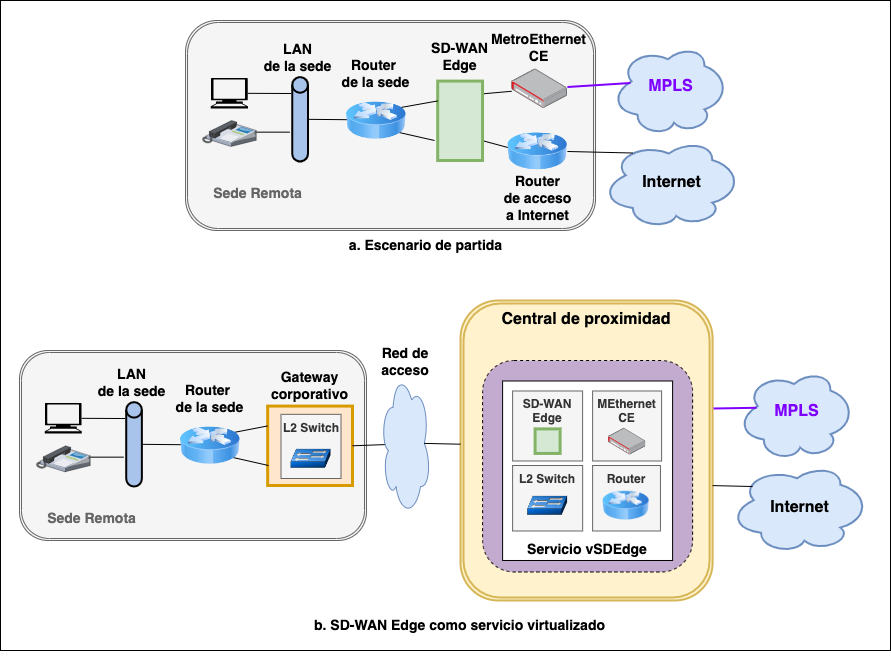
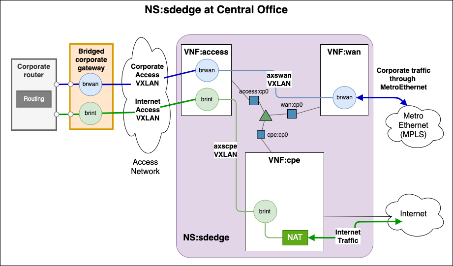

<!-- omit from toc -->
RDSV/SDNV Recomendaciones sobre el trabajo final
================================================

<!-- omit from toc -->
- [1. Instalación y arranque de la máquina virtual](#1-instalación-y-arranque-de-la-máquina-virtual)
- [2. Creación de repositorios propios](#2-creación-de-repositorios-propios)
  - [2.1 Carpetas](#21-carpetas)
  - [2.2 Repositorio docker](#22-repositorio-docker)
  - [2.3 Repositorio helm](#23-repositorio-helm)
- [3.](#3)
- [4. Modificación de la imagen de los contenedores de los escenarios VNX](#4-modificación-de-la-imagen-de-los-contenedores-de-los-escenarios-vnx)
  - [5. Partes opcionales](#5-partes-opcionales)
    - [Repositorio Docker privado](#repositorio-docker-privado)
  - [Otras recomendaciones](#otras-recomendaciones)
- [Resumen](#resumen)
- [Entorno](#entorno)
- [Escenario de la práctica](#escenario-de-la-práctica)
- [Referencias](#referencias)
- [Desarrollo del trabajo](#desarrollo-del-trabajo)
  - [1. Creación del repositorio helm](#1-creación-del-repositorio-helm)
  - [7. Conclusiones](#7-conclusiones)
- [Anexo I - Comandos](#anexo-i---comandos)
- [Anexo II - Figuras](#anexo-ii---figuras)

# 1. Instalación y arranque de la máquina virtual

Siga las instrucciones del la [práctica 4](rdsv-p4.md) para instalar y arrancar
la máquina virtual, y pruebe a desplegar el escenario VNX y el servicio _sdedge_
para la Serde remota 1, para comprobar que la instalación funciona
correctamente. 

# 2. Creación de repositorios propios

## 2.1 Carpetas

Se recomienda trabajar en la carpeta compartida `shared`. Deberá crear dentro
de ella una carpeta `rdsv-final`, y en ella copiar las siguientes carpetas de la
práctica 4:
- `helm`
- `img`
- `json`
- `pck`
- `vnx`
  
Además, copie los scripts:
- `start_sdedge.sh`
- `start_sdwan.sh`
- `osm_sdedge_start.sh`
- `osm_sdwan_start.sh`
- `sdedge1.sh` y `sdedge2.sh`
- `sdwan1.sh` y `sdwan2.sh`


## 2.2 Repositorio docker

Cree una cuenta gratuita en Docker Hub https://hub.docker.com para subir sus
contenedores Docker. A continuación, acceda a las carpeta con las definiciones 
de las imagen docker y haga login para poder subir las imágenes al repositorio:

```
cd img
docker login -u <cuenta>  # pedirá password la primera vez
```

<!--> A continuación, para evitar que la instalación del paquete `tzdata` solicite
interactivamente información sobre la zona horaria, añada al fichero
`Dockerfile`, tras la primera línea:

```
# variables to automatically install tzdata 
ARG DEBIAN_FRONTEND=noninteractive
ENV TZ=Europe/Madrid
```
-->

Después, añada un fichero README.txt que incluya los nombres de los integrantes
del grupo en cada contenedor, mediante una sentencia COPY en el Dockerfile de cada
imagen.

Una vez hecho esto, puede crear cada uno de los contenedores. Por ejemplo, para el caso de `vnf-acccess`:

```
cd vnf-acccess
docker build -t <cuenta>/vnf-acccess .
```

Y subirlo a Docker Hub

```
docker push <cuenta>/vnf-acccess
cd ..
```

## 2.3 Repositorio helm

Instale la herramienta `helm`. Para ello, desde un terminal de la máquina virtual ya arrancada, ejecute:

```shell
curl -fsSL -o get_helm.sh https://raw.githubusercontent.com/helm/helm/main/scripts/get-helm-3
chmod 700 get_helm.sh
./get_helm.sh
```

Fuera de la carpeta `shared`, cree una carpeta para almacenar los ficheros del repositorio helm, que va a publicar utilizando un contenedor de docker.

```shell
mkdir $HOME/helm-files
```

Aplique los siguientes cambios en los ficheros de definición de los helm charts:

```shell
cd ~/shared/rdsv-final/helm
# cambiar en los ficheros values.yaml de cada helm chart el valor de
image:
  repository: educaredes/vnf-img --> <cuenta>/vnf-img
```

Cree en `helm-files` los *paquetes* de los helm charts y el índice del
repositorio:

```shell
# crear en helm-files los paquetes correspondientes a los helm charts
cd ~/helm-files
helm package ~/shared/rdsv-final/helm/accesschart
helm package ~/shared/rdsv-final/helm/cpechart
helm package ~/shared/rdsv-final/helm/wanchart

# crear el índice del repositorio utilizando para la creación de las URLs
# la dirección IP de su máquina virtual en el túnel (prefijo 10.11.13.0/24)
helm repo index --url http://10.11.13.<X>/ .

# comprobar que se ha creado/actualizado el fichero index.yaml
cat index.yaml
```

Arranque mediante docker un servidor web `nginx`, montando `helm-files` 
como carpeta para el contenido:

```shell
docker run --name helm-repo -p 80:80 -v ~/helm-files:/usr/share/nginx/html:ro -d nginx
```
Compruebe que puede acceder al repositorio:

```shell
curl http://10.11.13.<X>/index.html
```

Registre el nuevo repositorio en osm, borrando antes el repositorio previamente registrado:

```shell
# borrar el repositorio
osm repo-delete sdedge-ns-repo
# comprobar que no hay repositorios registrados 
osm repo-list
# registrar el nuevo repositorio
osm repo-add --type helm-chart --description "rdsvY repo" sdedge-ns-repo http://10.11.13.<X>
```

Finalmente, arranque desde OSM una instancia del servicio `sdedge` y mediante
kubectl acceder a los contenedores para comprobar que incluyen el software
y los ficheros instalados.


# 3. 

Además, se pueden ya modificar los ficheros Dockerfile de cada una de las
imágenes  para que incluya otros paquetes de ubuntu que vaya a necesitar en la
imagen. Deberá también añadir el fichero `qos_simple_switch_13.py` con la
modificación que se propone en la [práctica de
QoS](http://osrg.github.io/ryu-book/en/html/rest_qos.html)

# 4. Modificación de la imagen de los contenedores de los escenarios VNX

Para instalar nuevos paquetes en la imagen
`vnx_rootfs_lxc_ubuntu64-20.04-v025-vnxlab` utilizada por los contenedores
arrancados mediante VNX se debe:

- Parar los escenarios VNX.
- Arrancar la imagen en modo directo con:

```
vnx --modify-rootfs /usr/share/vnx/filesystems/vnx_rootfs_lxc_ubuntu64-20.04-v025-vnxlab/
```

- Hacer login con root/xxxx e instalar los paquetes deseados.
- Parar el contenedor con:

```
halt -p
```

Arrancar de nuevo los escenarios VNX y comprobar que el software instalado ya 
está disponible.

Este método se puede utilizar para instalar, por ejemplo, `iperf3`, que no está
disponible en la imagen.

## 5. Partes opcionales

### Repositorio Docker privado 

Puede encontrar información detallada sobre la configuración de MicroK8s como
repositorio privado de Docker en [este documento](repo-privado-docker.md).

## Otras recomendaciones

- En el examen oral se pedirá arrancar el escenario desde cero, por lo que es
importante que todos los pasos para cumplir los requisitos mínimos estén
automatizados mediante uno o varios scripts. Si hay partes opcionales que se
configuran de forma manual, se deberán tener documentados todos los comandos
para ejecutarlos rápidamente mediante copia-pega. 

- Se recomienda dejar la parte de configuración de la calidad de servicio en la
KNF:access para el final, una vez que el resto del escenario esté funcionando
(túneles VXLAN, conectividad h1X-vcpe, DHCP, etc.).


# Resumen
En esta práctica, se va a profundizar en las funciones de red virtualizadas
(_VNF_) y su orquestación, aplicadas al caso de un servicio SD-WAN ofrecido por
un proveedor de telecomunicaciones. El escenario que se va a utilizar está
inspirado en la reconversión de las centrales de proximidad a centros de datos
que permiten, entre otras cosas, reemplazar servicios de red ofrecidos mediante
hardware específico y propietario por servicios de red definidos por software
sobre hardware de propósito general. Las funciones de red que se despliegan en
estas centrales se gestionan mediante una plataforma de orquestación como OSM o
XOS. 

Un caso de virtualización de servicio de red para el que ya existen numerosas
propuestas y soluciones es el del servicio vCPE (_Virtual Customer Premises
Equipment_). En nuestro caso, veremos ese servicio vCPE en el
contexto del acceso a Internet desde una red corporativa, y lo extenderemos para
llevar las funciones de un equipo SD-WAN Edge a la central de proximidad.



*Figura 1. Visión del servicio SD-WAN*

En concreto, partimos de un entorno SD-WAN (Figura  1.a), en el que se dispone
de equipos SD-WAN Edge sencillos "intercalados" entre el router de la LAN de una
sede remota y los equipos que dan salida hacia la red MPLS (MetroEthernet CE) y
hacia el proveedor de Internet (Router de acceso a Internet). 

Como muestra la Figura 1.b, el objetivo será sustituir los equipos de la sede
corporativa, tanto el equipo SD-WAN Edge como el router de acceso a Internet y
el MetroEthernet CE, por un único equipo cuya gestión sea mucho más sencilla.
Este equipo es el Gateway corporativo (_Bridged Customer Gateway_ o _BCG_), que
conecta a nivel 2 el router corporativo y la central de proximidad. 

El resto de las funciones se realizan en la central de proximidad aplicando
técnicas de virtualización de funciones de red (_NFV_). Para ello, se despliega
un servicio de SD-Edge virtualizado sobre la infraestructura de virtualización
de funciones de red (_NFVI_) de la central de proximidad. Este servicio incluye
las funciones de acceso a la red MPLS, router de acceso a Internet, y funciones
específicas de SD-WAN Edge que permitan aplicar las políticas de reenvío del
tráfico corporativo bien por MPLS, bien por un túnel sobre el acceso a Internet. 

La plataforma de gestión y orquestación del servicio será la
plataforma de código abierto [Open Source MANO (OSM)](https://osm.etsi.org). 


# Entorno

La Figura 2 representa el entorno en el que se va a desarrollar la práctica,
mostrando su relación con la arquitectura NFV definida por ETSI. Como plataforma
de gestión de VNFs se utilizará la plataforma de referencia de ETSI, Open Source
Mano (OSM), que, como se ha visto en la teoría, comprende los dos niveles
superiores del MANO: el NFVO para gestionar el ciclo de vida de los servicios de
red (NS); y el VNFM para gestionar el ciclo de vida de las funciones de red
(VNF). Como Virtualized Infrastructure Manager (VIM) se va a utilizar un clúster
de Kubernetes, que permite el despliegue de VNFs como contenedores,
habitualmente denominados KNFs.


*Figura 2. Arquitectura del entorno*

Kubernetes es una plataforma de código libre diseñada para el despliegue de
aplicaciones basadas en contenedores. Proporciona múltiples funciones de
escalabilidad, resistencia a fallos, actualizaciones y regresiones progresivas,
etc. que la hacen muy adecuada para el despliegue de VNFs. Kubernetes incluye su
propio gestor de paquetes, denominado Helm, que define la forma de crear y
operar repositorios en los que se almacenan los denominados Charts (paquetes en
terminología Helm). Básicamente, un Chart define un conjunto de recursos de
Kubernetes (contenedores, balanceadores, etc.) que se pueden posteriormente
desplegar sobre un clúster de Kubernetes. Adicionalmente, las imágenes de los
contenedores usados por Kubernetes suelen almacenarse en repositorios privados
o, más comúnmente, en el repositorio oficial de Docker denominado DockerHub.  

En la Figura 3 se aprecia con más detalle la relación entre las distintas
plataformas y repositorios involucrados en la práctica, que consistirá en el
despliegue de un servicio de red _sdedge_ compuesto por tres VNFs
interconectadas a través de una red virtual. Para desplegar dicho servicio se
proporcionan los descriptores del servicio y de las VNFs que lo componen,
escritos en YAML de acuerdo a las especificaciones de OSM. 


*Figura 3. Relación entre plataformas y repositorios*

# Escenario de la práctica

La Figura 4 muestra el escenario de red que se va a desplegar en la
práctica. Está formado por dos sedes remotas, y dos centrales de proximidad,
gestionadas desde la misma plataforma OSM. Cada central de proximidad
proporciona acceso a Internet y al servicio MetroEthernet ofrecido sobre una red
MPLS. 


*Figura 4. Arquitectura general*

Cada sede remota X (con X = 1 ó 2) está compuesta por:
  - una red de área local con dos sistemas finales simulando un PC (hX) y un
    teléfono (tX)
  - un router (rX) 
  - un gateway corporativo (bcgX)

El router rX tiene dos interfaces hacia el gateway bcgX, una para el tráfico
corporativo y otra para el tráfico Internet.  Como es normal, cada interfaz de
rX está configurada para una subred IP distinta, al igual que sucede en el caso
de disponer de un dispositivo físico SD-Edge instalado en la sede remota. 

La red de acceso a la central de proximidad se simula mediante Open vSwitch en
modo "standalone", es decir, operando como un conmutador Ethernet clásico, con
auto aprendizaje. Cada sede remota dispone de una red de acceso distinta
AccessNetX. Además, se simulan del mismo modo:
  - las redes externas ExtNetX 
  - la red MplsWan
  - el segmento de red denominado Internet
  
Los servicios de cada central de proximidad, gestionados desde la misma
plataforma OSM, serán desplegados mediante Kubernetes. Por limitaciones del
entorno, para la práctica se utiliza una única instancia de _microk8s_ para el
despliegue de los servicios las dos centrales de proximidad. 

La figura muestra que las centrales de proximidad disponen de una conexión a la
red MplsWan, emulada mediante Open vSwitch. En la red MplsWan está conectado el
equipo _voip-gw_, que simula un equipo de la red corporativa accesible
directamente a través del servicio MetroEthernet, en la misma subred IP
corporativa 10.20.0.0/24 en la que se conectan los routers r1 y r2.

Cada central de proximidad tiene también una conexión a una red externa ExtNetX
dónde se ubica el router ispX que proporciona salida hacia Internet. Los
routers, por otro lado, se encuentran directamente conectados al segmento
Internet, donde también se conecta el servidor s1.

Finalmente, el escenario se completa con un acceso a la Internet "real" a través
de los routers ispX, en los que se encuentra configurado un servicio NAT que
permite realizar pruebas de conectividad con servidores bien conocidos como el
8.8.8.8.

# Referencias

* [VNX](https://web.dit.upm.es/vnxwiki/index.php/Main_Page), página sobre la
  herramienta VNX utilizada para especificar y construir el escenario de red
* [OSM](https://osm.etsi.org), página de ETSI sobre el proyecto _Open Source NFV
  Management and Orchestration (MANO) - OSM_
* [Open vSwitch](https://www.openvswitch.org), switch software para ambientes
  Linux con soporte de OpenFlow
  
# Desarrollo del trabajo

## 1. Creación del repositorio helm

Instale la herramienta `helm`. Para ello, desde un terminal de la máquina virtual ya arrancada, ejecute:

```shell
curl -fsSL -o get_helm.sh https://raw.githubusercontent.com/helm/helm/main/scripts/get-helm-3
chmod 700 get_helm.sh
./get_helm.sh
```


## 7. Conclusiones
:point_right: Incluya en la entrega un apartado de conclusiones con su
valoración de la práctica, incluyendo los posibles problemas que haya encontrado
y sus sugerencias. 

# Anexo I - Comandos 

Muestra los descriptores registrados:

```
osm nsd-list
osm vnfd-list
```

Muestra las vnf y los ns activos:

```
osm ns-list
osm vnf-list
```

Ejecuta un `<comando>` en un pod:

```
kubectl  -n $OSMNS exec -it $PING -- <comando>
```

Abre una shell en un pod:

```
kubectl  -n $OSMNS exec -it $PING -- /bin/sh
```

Arranca consolas de KNFs:

```shell
bin/sdw-knf-consoles open <ns_id>
```

# Anexo II - Figuras


*Figura 1. Visión del servicio SD-WAN*

---


*Figura 2. Arquitectura del entorno*

---


*Figura 3. Relación entre plataformas y repositorios*

---


*Figura 4. Arquitectura general*

---


*Figura 5. Configuración del repositorio de helm charts*

---


*Figura 6. Servicio de red corpcpe*

---



*Figura 7. Servicio de red sdedge*

---


*Figura 8. Servicio de red sdedge configurado para SD-WAN*

---

