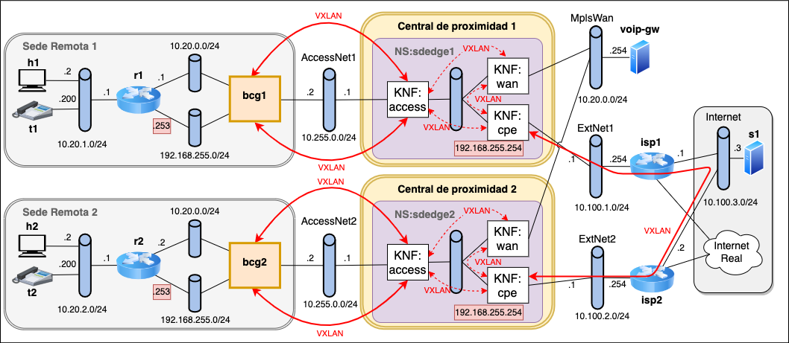

<!-- omit from toc -->
Servicios SD-WAN en centrales de proximidad
===========================================
- [Resumen](#resumen)
- [Entorno](#entorno)
- [Escenario de la práctica](#escenario-de-la-práctica)
- [Referencias](#referencias)
- [Desarrollo de la práctica](#desarrollo-de-la-práctica)
  - [1. Configuración del entorno](#1-configuración-del-entorno)
    - [1.1 Configuración de la máquina virtual](#11-configuración-de-la-máquina-virtual)
    - [1.2 Configuración de la máquina virtual](#12-configuración-de-la-máquina-virtual)
    - [1.3 Definición OSM del clúster k8s y configuración de red](#13-definición-osm-del-clúster-k8s-y-configuración-de-red)
    - [1.4 Registro del repositorio de helm charts](#14-registro-del-repositorio-de-helm-charts)
  - [2. Instalación de descriptores en OSM](#2-instalación-de-descriptores-en-osm)
  - [3. Arranque del escenario de red](#3-arranque-del-escenario-de-red)
  - [4. Servicio de red *corpcpe*](#4-servicio-de-red-corpcpe)
    - [4.1 Análisis de las KNFs](#41-análisis-de-las-knfs)
    - [4.2 Análisis del NS](#42-análisis-del-ns)
    - [4.3 (P) Imágenes vnf-access y vnf-cpe](#43-p-imágenes-vnf-access-y-vnf-cpe)
    - [4.4 Instanciación de corpcpe1](#44-instanciación-de-corpcpe1)
    - [4.5 (P) Conexión a las redes externas y configuración](#45-p-conexión-a-las-redes-externas-y-configuración)
  - [5. Servicio de red *sdedge*](#5-servicio-de-red-sdedge)
    - [5.1 Onboarding de KNFs](#51-onboarding-de-knfs)
    - [5.2 (P) Diseño y onboarding de NS](#52-p-diseño-y-onboarding-de-ns)
    - [5.3 Imagen vnf-wan](#53-imagen-vnf-wan)
    - [5.4 Instanciación de sdedge1](#54-instanciación-de-sdedge1)
    - [5.5 Conexión de sdedge1 a las redes externas y configuración](#55-conexión-de-sdedge1-a-las-redes-externas-y-configuración)
    - [5.6 Instanciación de sdedge2](#56-instanciación-de-sdedge2)
    - [5.7 (P) Conexión de sdedge2 a las redes externas y configuración](#57-p-conexión-de-sdedge2-a-las-redes-externas-y-configuración)
  - [6. (P) Configuración y aplicación de políticas de la SD-WAN](#6-p-configuración-y-aplicación-de-políticas-de-la-sd-wan)
  - [6. Conclusiones](#6-conclusiones)
- [Anexo I - Comandos](#anexo-i---comandos)
- [Anexo II - Figuras](#anexo-ii---figuras)

# Resumen
En esta práctica, se va a profundizar en las funciones de red virtualizadas
(_VNF_) y su orquestación, aplicadas al caso de un servicio SD-WAN ofrecido por
un proveedor de telecomunicaciones. El escenario que se va a utilizar está
inspirado en la reconversión de las centrales de proximidad a centros de datos
que permiten, entre otras cosas, reemplazar servicios de red ofrecidos mediante
hardware específico y propietario por servicios de red definidos por software
sobre hardware de propósito general. Las funciones de red que se despliegan en
estas centrales se gestionan mediante una plataforma de orquestación como OSM o
XOS. 

Un caso de virtualización de servicio de red para el que ya existen numerosas
propuestas y soluciones es el del servicio vCPE (_Virtual Customer Premises
Equipment_) en el contexto del servicio residencial de acceso a Internet, que se
resume en el Anexo I. En nuestro caso, extenderemos ese servicio vCPE, en el
contexto del acceso a Internet desde una red corporativa, para llevar las
funciones del equipo SD-WAN Edge a la central de proximidad.


Figura 1. Visión del servicio SD-WAN

En concreto, partimos del caso práctico de SD-WAN visto anteriormente en el
curso (Figura  1.a), en el que se disponía de equipos SD-WAN Edge sencillos
"intercalados" entre el router de la LAN de una sede remota y los equipos que
dan salida hacia la red MPLS (MetroEthernet CE) y hacia el proveedor de Internet
(Router de acceso a Internet). 

Como muestra la Figura 1.b, el objetivo será sustituir los equipos de la sede
corporativa, tanto el equipo SD-WAN Edge como el router de acceso a Internet y
el MetroEthernet CE, por un único equipo cuya gestión sea mucho más sencilla.
Este equipo es el Gateway corporativo (_Bridged Customer Gateway_ o _BCG_), que
conecta a nivel 2 el router corporativo y la central de proximidad. 

El resto de las funciones se realizan en la central de proximidad aplicando
técnicas de virtualización de funciones de red (_NFV_). Para ello, se despliega
un servicio de SD-Edge virtualizado sobre la infraestructura de virtualización
de funciones de red (_NFVI_) de la central de proximidad. Este servicio incluye
las funciones de acceso a la red MPLS, router de acceso a Internet, y funciones
específicas de SD-WAN Edge que permitan aplicar las políticas de reenvío del
tráfico corporativo bien por MPLS, bien por un túnel sobre el acceso a Internet. 

La plataforma de gestión y orquestación del servicio será nuevamente la
plataforma de código abierto _Open Source Mano (OSM)_, ya vista en el caso
práctico de plataformas NFV.


# Entorno

El entorno es el mismo que se ha utilizado para el caso práctico 2, usando OSM y
K8s como se muestra en la Figura 2.


Figura 2. Arquitectura del entorno

En la Figura 3 se aprecia con más detalle la relación entre las distintas
plataformas y repositorios involucrados en la práctica, que consistirá en el
despliegue de un servicio de red _sdedge_ compuesto por tres VNFs
interconectadas a través de una red virtual. Para desplegar dicho servicio se
proporcionan los descriptores del servicio y de las VNFs que lo componen,
escritos en YAML de acuerdo a las especificaciones de OSM. 


Figura 3. Relación entre plataformas y repositorios

# Escenario de la práctica

La Figura del Anexo II muestra el escenario de red que se va a desplegar en la
práctica. Está formado por dos sedes remotas, y dos centrales de proximidad,
gestionadas desde la misma plataforma OSM. Cada central de proximidad
proporciona acceso a Internet y al servicio MetroEthernet ofrecido sobre una red
MPLS. 

Cada sede remota X (con X = 1 ó 2) está compuesta por:
  - una red de área local con dos sistemas finales simulando un PC (hX) y un
    teléfono (tX)
  - un router (rX) 
  - un gateway corporativo (bcgX)

El router rX tiene dos interfaces hacia el gateway bcgX, una para el tráfico
corporativo y otra para el tráfico Internet.  Como es normal, cada interfaz de
rX está configurada para una subred IP distinta, de forma similar al caso
práctico SD-WAN.

La red de acceso a la central de proximidad se simula mediante Open vSwitch en
modo "standalone", es decir, operando como un conmutador Ethernet clásico, con
auto aprendizaje. Cada sede remota dispone de una red de acceso distinta
AccessNetX. Además, se simulan del mismo modo:
  - las redes externas ExtNetX 
  - la red MplsWan
  - el segmento de red denominado Internet
  
Los servicios de cada central de proximidad, gestionados desde la misma
plataforma OSM, serán desplegados mediante Kubernetes. Por limitaciones del
entorno, para la práctica se utiliza una única instancia de _microk8s_ para el
despliegue de los servicios las dos centrales de proximidad. 

La figura muestra que las centrales de proximidad disponen de una conexión a la
red MplsWan, emulada mediante Open vSwitch. En la red MplsWan está conectado el
equipo _voip-gw_, que simula un equipo de la red corporativa accesible
directamente a través del servicio MetroEthernet, en la misma subred IP
corporativa 10.20.0.0/24 en la que se conectan los routers r1 y r2.

Cada central de proximidad tiene también una conexión a una red externa ExtNetX
dónde se ubica el router ispX que proporciona salida hacia Internet. Los
routers, por otro lado, se encuentran directamente conectados al segmento
Internet, donde también se conecta el servidor s1.

Finalmente, el escenario se completa con un acceso a la Internet "real" a través
de los routers ispX, en los que se encuentra configurado un servicio NAT que
permite realizar pruebas de conectividad con servidores bien conocidos como el
8.8.8.8.

# Referencias

* [VNX](https://web.dit.upm.es/vnxwiki/index.php/Main_Page), página sobre la
  herramienta VNX utilizada para especificar y construir el escenario de red
* [OSM](https://osm.etsi.org), página de ETSI sobre el proyecto _Open Source NFV
  Management and Orchestration (MANO) - OSM_
* [Open vSwitch](https://www.openvswitch.org), switch software para ambientes Linux con soporte de OpenFlow
  
# Desarrollo de la práctica

## 1. Configuración del entorno
Para realizar la práctica debe utilizar la misma máquina virtual de las
prácticas anteriores, y seguir los pasos siguientes de configuración, similares 
a los pasos iniciales de la práctica 2. 

### 1.1 Configuración de la máquina virtual
Antes de arrancar la máquina, compruebe en la opción de configuración de
_Carpetas Compartidas_ que comparte una carpeta de su equipo con la máquina
virtual permanentemente, con punto de montaje `/home/upm/shared`. Asegúrese
además de haber configurado 4096 MB de memoria y 2 CPUs. 

### 1.2 Configuración de la máquina virtual
A continuación, arranque la máquina,  abra un terminal y descargue en el
directorio compartido el repositorio de la práctica: 

```
cd ~/shared
git clone https://github.com/educaredes/sdedge-ns.git
cd sdedge-ns
```

>**Nota:**
>Si ya lo ha descargado antes puede actualizarlo con:
>
>```
>cd ~/shared/sdedge-ns
>git pull
>```

Utilizando la \<letra\> asignada por los profesores, instale la red privada
virtual con el servidor OSM mediante:

```
cd ~/shared/sdedge-ns/bin
./install-tun <letra>
```

Compruebe que se ha establecido el túnel haciendo ping al servidor OSM:

```
ping 10.11.12.1
```

### 1.3 Definición OSM del clúster k8s y configuración de red 

Configure el entorno para acceder a OSM con su nombre de usuario y para
registrar su cluster k8s mediante:

```
cd ~/shared/sdedge-ns/bin
./prepare-osmlab <letter> 
```

A continuación, **cierre el terminal** y abra uno nuevo.

En el nuevo terminal, obtenga los valores asignados a las diferentes variables
configuradas para acceder a OSM (OSM_*) y el identificador del _namespace_ de
K8S creado para OSM (OSMNS):

```
echo "-- OSM_USER=$OSM_USER"
echo "-- OSM_PASSWORD=$OSM_PASSWORD"
echo "-- OSM_PROJECT=$OSM_PROJECT"
echo "-- OSM_HOSTNAME=$OSM_HOSTNAME"
echo "-- OSMNS=$OSMNS"
```

### 1.4 Registro del repositorio de helm charts 

A través de la GUI registraremos el repositorio de _helm
charts_ que utilizaremos en la práctica, alojado en Github Pages.

Acceda a la opción de menú _K8s Repos_, haga clic sobre el botón
 _Add K8s Repository_ y rellene los campos con los valores:
- Name: `helmchartrepo`
- Type: "Helm Chart" 
- URL: `https://educaredes.github.io/sdedge-ns` (NO DEBE TERMINAR EN "/")
- Description: _una descripción textual del repositorio_


Figura 4. Configuración del repositorio de helm charts

En la carpeta compartida `$HOME/shared/sdw-lab/helm` puede encontrar la
definición de los _helm charts_ que se usarán en esta práctica.

## 2. Instalación de descriptores en OSM

Desde la maquina virtual, acceda gráficamente al directorio 
`$HOME/shared/sdedge-ns/pck`. Realice el proceso de instalación de los 
descriptores de KNFs y del servicio de red (onboarding):
- Acceda al menu de OSM Packages->VNF packages y arrastre los ficheros
`accessknf_vnfd.tar.gz` y `cpeknf_vnfd.tar.gz`. 
- Acceda al menu de OSM Packages->NS packages y arrastre el fichero 
`corpcpe_nsd.tar.gz`.

Alternativamente, puede utilizar la línea de comandos:

```
osm vnfd-create $HOME/shared/sdedge-ns/pck/accessknf_vnfd.tar.gz
osm vnfd-create $HOME/shared/sdedge-ns/pck/cpeknf_vnfd.tar.gz
osm nsd-create $HOME/shared/sdedge-ns/pck/corpcpe_nsd.tar.gz
```

## 3. Arranque del escenario de red 

A continuación se va a arrancar el escenario de red que comprende las sedes
remotas, los routers _isp1_ e _isp2_ y los servidores _s1_ y voip-gw_. Primero
deberá comprobar que se han creado los witches `AccessNet1`, `AccessNet2`,
`ExtNet1`, `ExtNet2` y `MplsWan` tecleando en un terminal:

```shell
sudo ovs-vsctl show
```

Compruebe que están también están creados los correspondientes _Network
Attachment Definitions_ de _Multus_ ejecutando el comando:

```
kubectl get -n $OSMNS network-attachment-definitions
```

A continuación arranque el escenario con:

```shell
~/shared/sdedge-ns/vnx
vnx -f sdedge_nfv.xml -t
```

Por último, compruebe que hay conectividad en la sede remota 1, haciendo pruebas
en su LAN local 10.20.1.0/24 entre h1, t1 y r1. Compruebe también que hay
conectividad entre isp1, isp2 y s1 a través del segmento Internet 10.100.3.0/24.
Finalmente, compruebe que desde s1 tiene

## 4. Servicio de red *corpcpe*

Comenzaremos a continuación analizando el servicio de acceso a Internet
corporativo *corpcpe*. La Figura muestra los detalles de ese servicio. En trazo
punteado se han señalado algunos componentes que se encuentras configurados,
pero que no forman parte de este servicio, sino del servicio _sdedge_ que se
verá más adelante, y que será el que incluya el acceso a la red MPLS para la
comunicación entre sedes de la red corporativa. 


Figura 5. Servicio de red corpcpe

Este servicio establecerá una _SFC_ (_service function chain_ o "cadena de
funciones del servicio") para enviar el tráfico que proviene del router
corporativo hacia Internet. El tráfico llegará a través de VNF:access y pasará a
VNF:cpe, que aplicará NAT, utilizando una dirección IP pública que deberá
asignarse al servicio. Esta IP pública representa la dirección IP pública de un
router de acceso a Internet.

En el otro sentido, el servicio *corpcpe* recibirá el tráfico que proviene de
Internet con dirección destino la IP pública de VNC:cpe el NAT y lo reenviará
hacia su destino en la red corporativa, pasando por VNF:cpe y VNF:access. Será
necesario configurar en el servicio el prefijo de red utilizado por la sede
remota para que VNF:cpe realice correctamente el encaminamiento.

### 4.1 Análisis de las KNFs

Acceda al descriptor de las KNFs _access_ y _cpe_ gráfica y textualmente para
familiarizarse con ellas. Identifique la información sobre los _helm charts_ y
observe que cada KNF tiene un único "connection-point", que se corresponde con
la conexión que tendrá con otras KNFs a través de Kubernetes. Como se verá más
adelante, las conexiones a las redes externas se configurarán accediendo
directamente a los contenedores mediante _kubectl_. 

### 4.2 Análisis del NS 

Acceda gráfica y textualmente al descriptor del servicio de red _corpcpe_ para
familiarizarse con el servicio.

### 4.3 (P) Imágenes vnf-access y vnf-cpe
Las imágenes Docker que se usan por cada una de las KNFs ya se encuentran en
Docker Hub, en concreto en el repositorio
https://hub.docker.com/search?q=educaredes. Se van a analizar los ficheros
utilizados para la creación de esas imágenes: 

Desde el navegador de archivos en _~/shared/sdedge-ns_, acceda a las carpetas
_img/vnf-access_ y _vnf-cpe_. Observe que cada una de ellas contiene:

* un fichero de texto _Dockerfile_ con la configuración necesaria para crear la
  imagen del contenedor, 
* y en algún caso, ficheros adicionales que se copiarán a la imagen a través
  de la configuración del _Dockerfile_ y que serán  utilizados en la
  inicialización del contenedor.

(@) Identifique el nombre de la imagen estándar de partida para la creación de
vnf-access y de vnf-cpe (líneas FROM), y qué paquetes adicionales se están
instalando en cada caso. 

### 4.4 Instanciación de corpcpe1
Cree una instancia del servicio con nombre *_corpcpe1_*, que dará acceso a
Internet a la sede 1. Para ello, utilice:

```
export NSID1=$(osm ns-create --ns_name corpcpe1 --nsd_name corpcpe \
--vim_account dummy_vim)
echo $NSID1
```

Recuerde que mediante el comando `watch` puede visualizar el estado de la instancia del 
servicio: 

```
watch osm ns-list
```

Espere a que alcance el estado _READY_ y salga con `Ctrl+C`.

Si se produce algún error, puede borrar la instancia del servicio con el 
comando:

```
osm ns-delete $NSID1
```
Y a continuación lanzar de nuevo la creación de una nueva instancia.

Una vez arrancada la instancia del servicio puede acceder a los terminales de
las KNFs usando el comando:

```shell
bin/sdw-knf-consoles open $NSID1
```

A continuación, realice pruebas de conectividad básicas con ping y traceroute
entre las dos KNFs para comprobar que hay conectividad, a través de las
direcciones de la interfaz `eth0`.

### 4.5 (P) Conexión a las redes externas y configuración

A continuación se van a realizar una serie de configuraciones iniciales del
servicio instanciado. Aunque está previsto que este tipo de configuraciones se
realicen directamente a través de la plataforma de orquestación, en este caso,
por limitaciones del escenario de la práctica, se van a realizar accediendo a
los contenedores mediante _kubectl_. El fichero _cpe1_, junto con los ficheros
*osm_corpcpe_start.sh* y *corpcpe_start.sh*, contienen los comandos necesarios
para realizar las configuraciones necesarias del servicio. 

Acceda al contenido del fichero:

```shell
cat corpcpe1
```

Acceda también al contenido de los ficheros *osm_corpcpe_start.sh* y
*corpcpe_start.sh* que se invocan desde _corpcpe1_.

(@) A partir del contenido del script _corpcpe1_ y los demás scripts que se
llaman desde este, analice y describa resumidamente los pasos que se están
siguiendo para realizar la conexión a las redes externas y la configuración del
servicio.

A continuación aplique la configuración:

```shell
./corpcpe1
```

Y compruebe el funcionamiento del servicio, siguiendo los siguientes pasos para
probar la interconectividad entre h1 y s1:

* Desde la consola del host arranque una captura del tráfico en s1 con:

```shell
wireshark -ki s1-e1
```
 
* Desde h1, pruebe la conectividad con s1 mediante ping 10.100.3.3. 

(@) Guarde la captura con nombre _captura-h1s1_, para analizarla y adjuntarla
como resultado de la práctica.

(@) Analice el tráfico capturado y explique las direcciones MAC e IP que se ven
en los distintos niveles del tráfico, teniendo en cuenta que el servicio
ofrecido utiliza NAT.

A continuación, desde h1 compruebe el camino seguido por el tráfico a otros
sistemas del escenario y a Internet utilizando traceroute:

```shell
traceroute -In 192.168.255.254

traceroute -In 10.100.3.3

traceroute -In 8.8.8.8
```

(@) Explique los resultados de los distintos traceroute, indicando si se
corresponden con lo esperado.

```shell
osm ns-delete $NSID1
```

## 5. Servicio de red *sdedge*
A partir del servicio de red anterior, crearemos una nueva VNF y un nuevo NS
para ofrecer mediante el entorno OSM el servicio *sdedge*, que está preparado
para incluir la funcionalidad SD-WAN. La figura muestra los componentes
adicionales del servicio.


Figura 6. Servicio de red sdedge

### 5.1 Onboarding de KNFs

Realice el _onboarding_ de la KNF _wanknf_ mediante su descriptor
*wanknf_vnfd.tar.gz*, que puede encontrar en la carpeta pck.

```
osm vnfd-create $HOME/shared/sdedge-ns/pck/wanknf_vnfd.tar.gz
```

Acceda a su descriptor gráfica y textualmente, identificando la información
sobre el _helm chart_. 

### 5.2 (P) Diseño y onboarding de NS
A continuación, a través de OSM, modifique el descriptor del servicio de red
_corpcpe_ según se indica a continuación: (*Nota importante*: no olvide pulsar
el botón _Update_ para que se guarden los cambios una vez modificado el texto.
Si se cambia de solapa en el navegador sin guardar los cambios, estos se
perderán. Además, no utilice tabuladores para el sangrado del texto, use
espacios únicamente).

* Cambie los campos _id_ y _name_ a _sdedge_
* Cambie el valor de _designer_ y ponga su nombre y apellidos
* Modifique la descripción para hacer referencia al servicio SD-WAN
* Añada la KNF:wan como tercera KNF, duplicando el bloque de la KNF:cpe y
  reemplazando _cpe_ por _wan_, como sigue:
  
```
      - id: wan
        virtual-link-connectivity:
          - constituent-cpd-id:
              - constituent-base-element-id: wan
                constituent-cpd-id: mgmt-ext
            virtual-link-profile-id: mgmtnet
        vnfd-id: wanknf
```
* En la sección _vnfd-id:_, añada al final:

```
         - wanknf
```

Puede utilizar los botones de "Show Graph" para visualizar el resultado. Deberá
mostrar las tres VNFs interconectadas entre sí.

(@) Haga una foto o una captura de pantalla de la visualización gráfica del
servicio de red e inclúyala en la memoria de resultados de la práctica.

### 5.3 Imagen vnf-wan
Desde el navegador de archivos en _/home/upm/Desktop/sdw-cfi_, acceda a la
carpeta _img/vnf-wan_ y analice su contenido.

(@) Identifique el nombre de la imagen estándar de partida para la creación de
la imagen vnf-wan (línea FROM), y qué paquetes adicionales se están instalando. 

### 5.4 Instanciación de sdedge1

Cree una instancia del servicio con nombre *_sdedge1_*, que dará acceso a
Internet a la sede 1 y acceso a la red MPLS para la comunicación
intra-corporativa, permitiendo conectar con el equipo _voip-gw_. Para ello,
utilice:

```
export NSID1=$(osm ns-create --ns_name sdedge1 --nsd_name sdedge \
 --vim_account dummy_vim)
echo $NSID1
```

Usando:

```
watch osm ns-list
```

espere a que el servicio alcance el estado _READY_.

A continuación, acceda a los terminales de las KNFs usando el comando:

```shell
bin/sdw-knf-consoles open $NSID1
```

Y realice pruebas de conectividad básicas con ping y traceroute entre las tres
KNFs para comprobar que hay conectividad, a través de las direcciones de la
interfaz `eth0`.

### 5.5 Conexión de sdedge1 a las redes externas y configuración

A continuación se van a realizar las configuraciones iniciales del servicio
instanciado, accediendo a los contenedores mediante _kubectl_, como se explicó
anteriormente. El fichero _sdedge1_, junto con los ficheros
*osm_sdedge_start.sh* y *sdedge_start.sh*, contienen los comandos necesarios
para realizar las configuraciones necesarias del servicio. 

(@) Acceda al contenido de esos tres ficheros. Compare *osm_sdedge_start.sh* con
*osm_sdedge_start.sh*:

```shell
diff osm_corpcpe_start.sh osm_sdedge_start.sh
```

Y explique las diferencias observadas. Acceda también al contenido del fichero
*start_sdedge.sh* que se invoca desde *osm_sdedge_start.sh*.

(@) A partir del contenido de los distintos scripts, analice y describa
resumidamente los pasos que se están siguiendo para realizar la conexión a las
redes externas y la configuración del servicio, comparándolo con el servicio
_corpcpe_.

A continuación aplique la configuración:

```shell
./sdedge1 
```

Y compruebe el funcionamiento del servicio, verificando que sigue teniendo
acceso a Internet, y que ahora tiene acceso desde h1 y t1 al equipo voip-gw.

### 5.6 Instanciación de sdedge2
Cree a continuación una nueva instancia del servicio _sdedge_ de nombre
*_sdedge2_*. Esta instancia permitirá dar acceso a la sede 2 tanto a Internet
como a la red MPLS. Para ello, utilice:

```
export NSID2=$(osm ns-create --ns_name sdedge2 --nsd_name sdedge \
--vim_account dummy_vim)
echo $NSID2
```

Usando:

```
watch osm ns-list
```

espere a que el servicio alcance el estado _READY_.

Acceda a los terminales de las VNFs usando el comando:

```shell
bin/sdw-knf-consoles open $NSID2
```

Y realice pruebas de conectividad básicas con ping y traceroute entre las tres
KNFs para comprobar que hay conectividad, a través de las direcciones de la
interfaz `eth0`. Observe que las direcciones asignadas son diferentes de las
asignadas a las KNFs de _sdedge1_. 

### 5.7 (P) Conexión de sdedge2 a las redes externas y configuración
Cree una copia del sdedge1:

```shell
cp sdege1 sdedge2
```

A partir de la información de las direcciones IP para la Sede remota 2 (vea
Anexos), realice los cambios necesarios en el script _sdedge2_ para conectar a
las redes externas y configurar las KNFs del servicio _sdedge2_. 
 
(@) Deberá entregar el script _sdedge2_ como parte del resultado de la práctica.

A continuación aplique la configuración:

```shell
./sdedge2 
```

Para probar el servicio, compruebe que ahora tiene acceso desde h2 y t2 a
Internet y al equipo voip-gw. Además, deberá realizar las siguientes pruebas de
interconectividad entre las dos sedes:

* Desde la consola de la KNF:wan del servicio sdedge1, lance una captura de
  tráfico en la interfaz net1, que da salida a la red MplsWan.

```shell
tcpdump -i net1
```

* Desde h1 lance un ping de 3 paquetes a h2:

```shell
ping -c 3 10.20.2.2
```

El tráfico del ping deberá verse en la captura, ya que inicialmente la KNF:wan
se configura para conmutar el tráfico entre KNF:access y dicha red. 

(@) Como resultado de este apartado, incluya el texto resultado de la captura.

Puede dejar corriendo la captura, le servirá para comprobar qué tráfico se
conmuta a través de MplsWan en el siguiente apartado.

## 6. (P) Configuración y aplicación de políticas de la SD-WAN

A continuación, sobre los servicios de red _sdedge_ desplegados en cada una de
las sedes, se configurará el servicio SD-WAN y se aplicarán las políticas de red
correspondientes al servicio. En este caso de estudio, y tomando como referencia
la Figura del Anexo II, las políticas aplicadas permitirán cursar el tráfico
entre los hosts h1 y h2 a través del túnel VXLAN inter-sedes sobre Internet,
mientras que el tráfico entre los "teléfonos IP" t1 y t2 se continuará enviando
a través de la red MPLS. 

La figura muestra resaltados los componentes configurados para el servicio
SD-WAN.


Figura 7. Servicio de red sdedge configurado para SD-WAN

Para realizar las configuraciones de SD-WAN sobre el servicio de red _sdedge_ se
utilizan los scripts _sdwan1,sh_ junto a los scripts *osm_sdwan_start.sh* y
*sdwan_start.sh*. Acceda al contenido de esos ficheros, así como al contenido de
la carpeta _json_.

(@) A partir de la figura, del contenido de los scripts y de los ficheros json,
analice y describa resumidamente los pasos que se están siguiendo para realizar
la configuración del servicio y la aplicación de políticas. 

A continuación aplique los cambios sobre el servicio de la sede central 1:  

```shell
./sdwan1.sh
```

Tras realizar los cambios, obtendrá por pantalla el comando necesario para
ejecutar el navegador Firefox con acceso al controlador SDN que se ejecuta en la
KNF:wan de la sede central 1, lo que le permitirá ver las reglas aplicadas en el
conmutador _brwan_.

Aplique también los cambios sobre el servicio de la sede central 2:  

```shell
./sdwan2.sh
```

A continuación, deberá realizar las siguientes pruebas de interconectividad
entre las dos sedes:

* Desde la consola del host arranque una captura del tráfico isp1-isp2 con:

```shell
wireshark -ki isp1-e2
```
 
* Desde h1 lance un ping a h2 (dir. IP 10.20.2.2). El tráfico atraviesa isp1 e
  isp2, tal y como puede comprobar en la captura de tráfico. 

(@) Guarde la captura con nombre _captura-h1h2_, para analizarla y adjuntarla
como resultado de la práctica.

(@) Analice el tráfico capturado y explique las direcciones MAC e IP que se ven
en los distintos niveles del tráfico, teniendo en cuenta que se ha encapsulado
por un túnel VXLAN.

* Desde t1 lance un ping a t2 (dir. IP 10.20.2.200). El tráfico no debe pasar
  por isp1-isp2, se debe encaminar por MPLS.

A continuación, desde h1 y desde t1 compruebe el camino seguido por el tráfico a
otros sistemas del escenario y a Internet utilizando traceroute.

## 6. Conclusiones
(@) Incluya en la entrega un apartado de conclusiones con su valoración de la
práctica, incluyendo los posibles problemas que haya encontrado y sus
sugerencias. 

# Anexo I - Comandos 

Muestra los descriptores registrados:

```
osm nsd-list
osm vnfd-list
```

Muestra las vnf y los ns activos:

```
osm ns-list
osm vnf-list
```

Ejecuta un `<comando>` en un pod:

```
kubectl  -n $OSMNS exec -it $PING -- <comando>
```

Abre una shell en un pod:

```
kubectl  -n $OSMNS exec -it $PING -- /bin/sh
```

Arranca consolas de KNFs

```shell
bin/sdw-knf-consoles open <ns_id>
```

# Anexo II - Figuras


Fig II.1.  Arquitectura general
